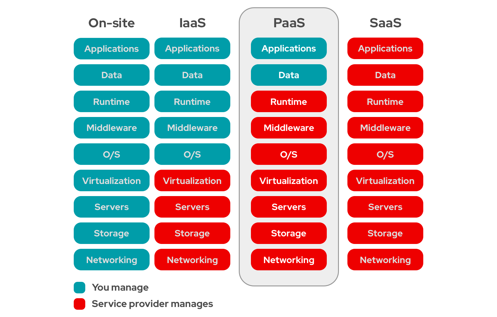
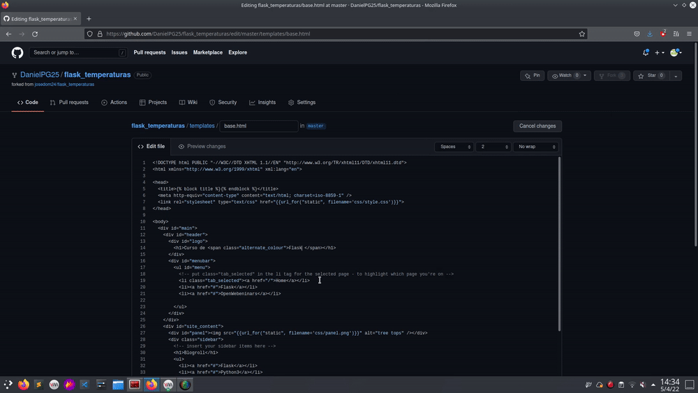

# Despliegue Continuo de Aplicaciones Web usando Openshift 

<p align="center">
    
</p>

## Índice

#### [1. Introducción](#introducción)


#### [2. Objetivos del proyecto](#objetivos)

#### [3. Fundamentos Teóricos](#fundamentos-teóricos)

##### [¿Qué es PaaS?](#qué-es-paas-1)

##### [¿Qué es OpenShift?](#qué-es-openshift-1)

##### [¿Qué es Ngrok?](#¿qué-es-ngrok-1)
#### [4. Escenario que se ha montado](#escenario-que-se-ha-montado)

##### [Minishift](#minishift-1)

##### [CodeReady Containers (CRC)](#codeready-containers-crc-1)

##### [Escenario](#escenario)

#### [5. Realización de la parte práctica](#casos-prácticos)

##### [Image2Source](#image2source-de-una-aplicación-basada-en-python)

##### [Dockerfile](#creación-de-una-aplicación-a-partir-de-un-dockerfile)

##### [Plantilla](#creación-de-una-aplicación-a-partir-de-una-plantilla)

#### [6. Conclusiones](Conclusiones/Conclusiones.md)

#### [7. Bibliografía](Bibliografia/Bibliografia.md)

-----------------------------------------------------

### Introducción

En este proyecto vamos a aprender como desplegar de forma continua aplicaciones web utilizando una herramienta llamada OpenShift. Esta es una herramienta muy potente la cual, como veremos a lo largo del proyecto, facilitará mucho la labor a los desarrolladores y programadores, haciendo que puedan implantar sus aplicaciones con mucha facilidad.

### Objetivos 

Con la realización de este proyecto se pretenden conseguir los siguientes objetivos:

+ Lograr una mayor comprensión de los que es Openshift y su ámbito de aplicación.
+ Desplegar aplicaciones en diferentes lenguajes de programación a través de Openshift utilizando la funcionalidad Source2Image.
+ Conseguir implementar un despliegue continuo de las aplicaciones usando el Webhook de Github.
+ Realizar los despliegues tanto en local con "CodeReady Containers" como online con la prueba gratuita que ofrece Red Hat.
  
Estos son los objetivos iniciales, por lo que a medida que se vaya desarrollando el proyecto comprobaremos si pueden cumplirse o no.

### Fundamentos Teóricos

#### ¿Qué es PaaS?

"PaaS" (*Platform as a Service* o Plataforma como Servicio) es una modalidad de Cloud Computing especialmente pensada para desarrolladores y programadores, ya que permite a los mismos desarrollar sus aplicaciones sin tener que preocuparse por la infraestructura ni el *middleware*, herramientas de desarrollo, administración de bases de datos, etc. Básicamente ofrecen al desarrollador/programador total libertad para crear sus aplicaciones sin tener que preocuparse por nada más. Existen otras modalidades de Cloud Computing como son la Infraestructura como Servicio ("IaaS") y el Software como Servicio ("SaaS"). Las diferencias entre ellos las podemos apreciar en la siguiente imagen:

<p align="center">
    
</p>

Como podemos ver, en el caso del "IaaS", el proveedor se encarga únicamente de mantener la infraestructura, dejando el resto en manos del usuario, mientras que en el "SaaS", el proveedor de encarga de todo, de forma que usuario solo debe preocuparse de usar el software que ha contratado.

#### ¿Qué es OpenShift?

Actualmente, OpenShift es considerado como una distribución completa de Kubernetes, y un servicio de *Cloud Computing* de tipo PaaS. Con OpenShift, los desarrolladores y programadores pueden llegar a desplegar sus aplicaciones directamente desde el código fuente, sin la necesidad de conocer como funciona internamente OpenShift. 

OpenShift utiliza Kubernetes y Docker para hacer el despliegue de las aplicaciones en contenedores, integrando de forma muy eficaz diferentes lenguajes de programación en los que los desarrolladores pueden escribir y crear sus aplicaciones. OpenShift se encargará de desplegar la aplicación indicada y de mantener los servicios subyacentes a la aplicación, a la vez que garantiza la escalabilidad de la aplicación según sea necesario.

Debido a las características de OpenShift vamos a poder desplegar nuestras aplicaciones en diferentes entornos (desarrollo, producción, etc), pudiendo incluso programar a través de OpenShift una integración continua o un despliegue continuo, simplificando el trabajo que de otra forma tendríamos que realizar manualmente si usáramos Kubernetes de forma independiente. Hay varias formas formas de comunicarse con OpenShift (CLI, aplicación web, API RESTFUL).

Una de las principales ventajas que ofrece OpenShift es que podemos desplegar directamente las aplicaciones que desarrollemos utilizando la funcionalidad *Source2Image*. Esta funcionalidad nos permite seleccionar un repositorio en el cual se encuentra el código de la aplicación y una imagen base de las que nos ofrece OpenShift o que hayamos creado nosotros, y combinando estas dos cosas, ya se encarga Openshift de todo lo que conlleva el despliegue de la aplicación (compilación, descarga de paquetes necesarios, creación de la ruta de acceso a la misma, comunicación entre los contenedores, etc). De esta forma, es posible que los desarrolladores se centren exclusivamente en el desarrollo de la aplicación, dejando todo lo demás en manos de OpenShift.

Debido a que OpenShift es un producto de Red Hat, la mayoría de las opciones para practicar y aprender a usar OpenShift son de pago. Red Hat nos ofrece una capa gratuita temporal muy limitada (uno o dos meses), por lo que para este proyecto vamos a tener opciones, las cuales desarrollaremos con más profundidad en el siguiente apartado. 

#### ¿Qué es Ngrok?

Ngrok es una herramienta que nos permite exponer al exterior servidores que se encuentran en una red local a través de diversos tipos de túneles (HTTP, TLS, TCP, etc). Esto nos permite hacer que nuestro servidor de Openshift pueda recibir notificaciones desde fuera de la red local, lo que nos será muy útil, sobre todo a la hora de configurar los `webhooks` de Github.

Es una herramienta de pago que ofrece una capa gratuita, que será la que usaremos en el proyecto. Podemos encontrar más información sobre "Ngrok" en el siguiente [enlace](https://ngrok.com/docs).

### Escenario que se ha montado

Openshift es una herramienta de pago de Red Hat, por lo que a la hora de utilizarla, si no queremos pagar, tenemos básicamente dos opciones disponibles:

1. Minishift
2. CodeReady Containers (CRC)
   
#### Minishift

Minishift es una herramienta de software libre que crea una máquina virtual con un solo cluster de Openshift. No necesita de registro ni subscripciones en ninguna página. Esta herramienta necesita de una software de virtualización para poder funcionar, admitiendo los siguientes softwares:

* Windows:
    + [Hyper-V](https://docs.microsoft.com/en-us/virtualization/hyper-v-on-windows/quick-start/enable-hyper-v)

* Linux:
    + [KVM](https://en.wikipedia.org/wiki/Kernel-based_Virtual_Machine)

* MacOS:
    + [hyperkit](https://github.com/moby/hyperkit)

* Todos los anteriores:
    + [VitualBox](https://www.virtualbox.org/wiki/Downloads) (A partir de la versión 5.1.12)

Esta es una gran herramienta para realizar pruebas en local, pero cuenta con el inconveniente de que la versión de Openshift que utiliza es la 3 (en el momento de escribir esto). Esto, para la realización de este proyecto es un gran incoveniente, ya que el cambio de la versión 3 a la 4 de Openshift es bastante grande e influye en muchas cosas. Si aún así, no tienes problemas con este inconveniente y quieres usar "minishift", el siguiente [enlace](https://docs.okd.io/3.11/minishift/getting-started/index.html) te dará más información.

#### CodeReady Containers (CRC)

CodeReady Containers es una herramienta, que al igual que ocurre con "minishift" despliega una máquina virtual en la que se instala un cluster de Openshift de un solo nodo. Esta herramienta es ofrecida por la propia Red Hat, por lo que es necesario tener, como mínimo, una cuenta gratuita en Red Hat. La máquina que crea tiene los siguientes requisitos de hardware: 9 GB de ram, 4 vcpu y 35 GB de disco duro disponible. Debido a esto, es remendable tener una máquina algo potente para poder usar herramienta, ya que esos son los requisitos de la máquina virtual, no de la antitriona. También es necesario que el sistema operativo anfitrión sea Centos (versión 7.5 o mayor), Red Hat o Fedora (las dos últimas versiones estables).

La gran ventaja que ofrece esta herramienta con respecto a "minishift", es que podemos usar la versión 4 de Openshift, por lo que es una herramienta que nos ofrece la capacidad de administrar y utilizar un cluster de Openshift con todas las funcionalidades que ofrece dicha versión. Es debido a esto, que para la realización de este proyecto vamos a utilizar esta herramienta y no "minishift".

--------------------------------------------------

#### Escenario

Dicho esto, vamos a explicar como montar el escenario en el que desarrollaremos el proyecto:

1. En primer lugar, he creado una máquina virtual con el sistema operativo Centos 8, con 10 GB de ram, 6 vcpu y 60 GB de disco duro.
2. Nos aseguramos de que nuestro usuario (no `root`) esté en el grupo de `sudoers` (tenga permisos de `root`).
3. Instalamos los paquetes necesarios:
   
```
sudo dnf install -y libvirt NetworkManager
```

4. Descargamos crc:

<p align="center">
    
</p>

5. Descomprimimos el fichero:

```
tar xvf crc-linux-amd64.tar.xz
```

6. Dentro hay un binario llamado `crc`. Este binario lo movemos a algún directorio que se encuentre en el PATH:

```
sudo install crc /usr/local/bin/crc
```

7. Ejecutamos el siguiente comando, el cual comprobará si la máquina cumple con los requisitos y realizará la configuración necesaria para instalar la máquina virtual:

```
crc setup
```

8. Una vez que haya finalizado el comando anterior, debemos ejecutar el siguiente para levantar la máquina virtual y el cluster:

```
crc start
```

9. Durante la primera inicialización, nos pedirá un `pull secret`, para verificar que estamos registrados en Red Hat. Dicho `pull secret` lo podemos encontrar en la misma página de donde descargamos CRC:

<p align="center">
    
</p>

10.  A continuación, instalamos el comando `oc` y ejecutamos el siguiente comando:

```
oc adm policy add-scc-to-user anyuid -z default
```

*Nota:* El `default` lo sustituimos por el "namespace" o proyecto con el que estemos trabajando. 

El comando anterior nos permite crear contenedores que se ejecutan como `root`, algo que normalmente (por seguridad) no está permitido en Openshift. En un contexto real, un administrador daría los permisos individuales o de grupo que los desarrolladores necesitaran, y se usarían imágenes adaptadas a Openshift, por lo que el uso de dicho comando no sería necesario, pero para el contexto del proyecto nos viene muy bien para hacer las pruebas y prácticas que necesitemos.

Así pues, hemos terminado de crear el escenario con el que trabajaremos a lo largo del proyecto.

### Casos Prácticos

Para este proyecto vamos a ver las diferentes formas que tiene Openshift de crear contendedores. Antes hemos mencionado el Source2Image, pero Openshift nos ofrece también otras opciones que son bastante interesantes.

#### Image2Source de una aplicación basada en python

En primer lugar, vamos a comenzar con una aplicación simple escrita en pyhton. Para ello he elegido la aplicación desarrollada por José Domingo Muñoz de "temperaturas_flask", la cual la podéis encontrar en el siguiente [repositorio](https://github.com/josedom24/flask_temperaturas). Esta aplicación nos muestra la temperatura máxima y mínima del día en el municipio de Sevilla que le indiquemos. Así pues, lo primero que hemos hecho ha sido hacer un fork del repositorio y actualizar el fichero "requirements.txt", ya que la versión de los paquetes estaban desactualizadas y darían problemas en openshift:

```
Flask==2.0
itsdangerous==2.1.2
Jinja2==3.1.1
lxml==4.6.3
MarkupSafe==2.1.1
Werkzeug==2.1.0
```

Una vez que hemos hecho esto, entramos en la consola web de Openshift e indicamos que vamos a crear una nueva aplicación importando el código desde Git:

<p align="center">
    
</p>

A continuación, solo tenemos que indicarle el repositorio en el que se encuentra el código, y algunas pequeñas configuraciones (puerto en el que escucha la aplicación, nombre de la misma, etc):

<p align="center">
    
</p>

Una vez que hemos terminado de añadir esa configuración, le damos a crear y listo. Con esto ya se encarga Openshift de todo lo demás (crear deployment, replicasets, pods, servicios, rutas, etc):

<p align="center">
    
</p>

Pasado un tiempo, se desplegarán los pods y podremos acceder a la aplicación a través del servicio y la ruta que crea automáticamente Openshift:

<p align="center">
    
</p>

<p align="center">
    
</p>

Como hemos visto, hemos podido desplegar una aplicación y ponerla en funcionamiento de forma muy sencilla, sin tener que crear por nuestra cuenta ninguno de los recursos que tendríamos que haber creado si hubiéramos tenido que desplegarla en Kubernetes o Docker (ReplicaSet, Service, Deployment, Dockerfile, etc). Sin embargo, esto no es todo. Openshift también nos ofrece la posibilidad de implantar las aplicaciones de forma continua, lo que se conoce como "Despliegue Continuo". Para ello nos ofrece varias posibilidades, de entre las cuales me he decantado por usar el `Webhook` de Github, el cual avisará a Openshift cada vez que se produzca un cambio en un repositorio.

Hacer esto en un cluster real es más sencillo que hacerlo en local, ya que normalmente las empresas disponen de repositorios privados y dichos repositorios tienen acceso al cluster de Openshift. Sin embargo, al tener nuestro cluster desplegado en CRC y en local, Github no puede comunicarse con él, por lo que no puede enviar el Webhook. Para solventar este problema, vamos a usar una herramienta gratuita llamada `ngrok`, la cual nos creará un túnel http a través del cual Github podrá comunicarse con nuestro cluster de Openshift local.

Para ello, una vez que hemos instalado la herramienta, ejecutamos el siguiente comando **dentro** de la máquina virtual que crea CRC (para que funcione no debemos cortar la ejecución del comando en ningún momento):

```
ngrok http https://localhost:6443
```

Una vez hecho esto, nos creará lo siguiente:

<p align="center">
    
</p>

El enlace marcado en rojo es el que tenemos que añadir a la configuración del `Webhook` de Github. También debemos añadir lo siguiente en la configuración: `/apis/build.openshift.io/v1/namespaces/prueba/buildconfigs/flask-temperaturas/webhooks/<SECRET>/github` (la ruta del `Webhook` nos la indica el propio build de la aplicación). Así pues, la configuración del `Webhook` queda de la siguiente forma:

<p align="center">
    
</p>

Ahora, cada vez que se haga un `push` al repositorio, enviará mensaje a Openshift avisando del cambio, el cual generará un nuevo build:

<p align="center">
    
</p>

Como vemos, al hacer un cambio en el repositorio, se ha activado una nueva build. Cuando termine, si accedemos a la página de la aplicación, podemos ver que el cambio se ha producido correctamente:

<p align="center">
    
</p>

#### Creación de una aplicación a partir de un Dockerfile

Anteriormente hemos comprobado como Openshift puede crear una aplicación a partir del código fuente de la misma y una imagen base. Sin embargo, esta no es la única opción que nos ofrece Openshift para crear las aplicaciones. Ahora veremos otra de las opciones: crear una aplicación a partir de un Dockerfile.

Así pues, he creado un Dockerfile a partir del cual se desplegará una aplicación escrita en `php` llamada `bookmedik`. Dicho Dockerfile se encuentra en este [repositorio de Github](https://github.com/DanielPG25/bookmedik_openshift.git). Esta aplicación necesita de una base de datos para poder funcionar, por lo que en primer lugar he creado dicha base de datos usando como base la imagen de mariadb que nos ofrece openshift:

<p align="center">
    
</p>

Dicha imagen es bastante simple de configurar, ya que lo único que nos pide son las variables de entorno necesarias para configurar mariadb (contraseña de root, nombre de la base de datos, etc):

<p align="center">
    
</p>

Una vez hecho esto, ya podemos ponernos a crear la aplicación de bookmedik. Para ello, al igual de hicimos anteriormente, le indicamos el repositorio en el que se encuentra el fichero Dockerfile:

<p align="center">
    
</p>

Como vemos, Openshift detecta automáticamente el Dockerfile y nos indica que esa es la opción deseable para construir la aplicación. Solo debemos indicarle el puerto en el cual escuchará la aplicación. Así pues, le indicamos que queremos que construya la aplicación a partir de dicho Dockerfile, lo cual generará todos los recursos y procesos necesarios para crear la aplicación (build, deployment, services, etc). Pasado un tiempo, ya tendremos creada y lista nuestra aplicación `bookmedik`:

<p align="center">
    
</p>

Si entramos en la ruta que se ha creado automáticamente, nos encontramos a la aplicación funcionando perfectamente:

<p align="center">
    
</p>

<p align="center">
    
</p>

El despliegue continuo se configura exactamente de la misma forma forma que en el paso anterior: activar ngrok, cambiar la url en el webhook de Github, etc. Así pues, una vez hecho esto, cada vez que hagamos un cambio en el repositorio, Github avisará a Openshift y volverá a saltar el build y el despliegue de la aplicación:

<p align="center">
    
</p>

Y si entramos en la aplicación, vemos que se ha producido el cambio:

<p align="center">
    
</p>

Como vemos, desplegar aplicaciones tanto desde el código fuente usando Image2Source, como desplegarlas desde un fichero Dockerfile es bastante sencillo, lo que proporciona muchas posibilidades a los desarrolladores que trabajen con Openshift y no quieran/puedan aprender sobre como funiona Kubernetes y/o Docker. 
#### Creación de una aplicación a partir de una Plantilla

Este método es algo más avanzado que los dos anteriores, y se escapa un poco de la filosofía que hemos presentado antes de que los desarrolladores no tenían por qué conocer como funciona Kubernetes para saber como desplegar sus aplicaciones. Sin embargo, debido a la gran potencia y versatilidad que ofrece, vamos a presentar como desplegar una aplicación usando una plantilla (Template). 

Una plantilla es simplemente una representación escrita de los recursos que va a necesitar nuestra aplicación, escrita en un fichero "yaml" o "json". Es básicamente un maniefiesto en el cual aparecen todos los recursos que serán necesarios para desplegar nuestra aplicación. Dichos recursos, en los dos apartados anteriores los creaba automáticamente Openshift. Entonces, ¿cuál es la ventaja de usar plantillas?

La principal ventaja de crear plantillas radica en la gran versatilidad y grado de personalización que podemos dar a los recursos que creemos. También nos ofrece la posibilidad de agrupar recursos necesarios para una misma aplicación. Así pues, en el apartado anterior, tenía que crear primero los recursos de la base de datos que necesita `bookmedik` y después los recursos del propio `bookmedik`. Si por alguna razón quisiera volver a crear dicha aplicación en otro proyecto, tendría que volver a realizar los mismos pasos, lo que a la larga consumiría bastante tiempo. 

Es por ello que usamos plantillas para agrupar recursos y ahorrar tiempo, ya que si hubiéramos usado una plantilla para desplegar la aplicación, solo tendríamos que seleccionar dicha plantilla y tanto la aplicación en sí como la base de datos se crearían a la vez y en un momento. Dicho esto, en este apartado vamos a desplegar la aplicación `Wordpress` junto con una base de datos `MySQL` usando la siguiente [plantilla](Practica/wordpress-template.yaml), en la cual hemos configurado también el almacenamiento persistente tanto para la base de datos como para los ficheros (imágenes, audios, vídeos, etc) que subamos a nuestro `Wordpress`.

Para poder usar dicha plantilla, nos dirigimos al apartado de `Add+` o le damos al botón de `+` en la parte superior de la pantalla:

